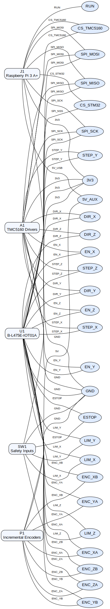

# CNC Controller (STM32L475 – B-L475E-IOT01A) — Projeto & Protocolo

Este repositório descreve e implementa um **controlador CNC** baseado no **STM32L475** (kit **B-L475E-IOT01A**), com:

- **Eixo X** com **encoder AB** de **40 pulsos por rotação** monitorado pelo **TIM3** (16 bits).
- **Eixo Y** com **encoder AB** de **2 500 pulsos por rotação** usando o **LPTIM1** (16 bits acumulados em software).
- **Eixo Z** com **encoder AB** de **40 pulsos por rotação** registrado pelo **TIM5** (32 bits).
- **Gerador de passos (DDA)** em **50 kHz** (TIM6) com **STEP/DIR/EN** para 3 drivers **TMC5160**.
- **Controle PI/PID** a **1 kHz** (TIM7), leitura de encoders e serviços.
- **SPI2 (Slave, MODE 3, DMA)** para comunicação com **Raspberry Pi** (master) via conector PMOD.
- **USART1 (VCP)** para **logs via USB ST-LINK**.
- **Framing SPI** compatível com o HDL/FPGA (headers/tails AA..55 / AB..54) e *router* de mensagens.

> Foco: **determinismo de tempo**, **sincronismo entre eixos**, **baixa latência** e uma base de código **fácil de manter** com CubeMX/CubeIDE.

---

## 1) Hardware & Relógios (Clocking)

- **Placa**: ST **B-L475E-IOT01A** (STM32L475VG, Cortex-M4F @ **80 MHz**).
- **Clock** (CubeMX → Clock Configuration):
  - **HCLK = 80 MHz**, **APB1 = /2**, **APB2 = /1**.
  - Regra ST: com prescaler APB ≠ 1, **TIMxCLK = 2×PCLK**.
  - Assim, **TIM2/3/4/5/6/7** (APB1) e **TIM1/8/15/16/17** (APB2) operam a **80 MHz**; o **LPTIM1** também recebe o **PCLK1** (80 MHz) quando configurado para clock APB.
- **Drivers**: **TMC5160**, SPI **MODE 3** (CPOL=1, CPHA=2), SCK recomendado **4–8 MHz** conforme clock do TMC.
- **Encoders**:
  - **X/Z**: 40 **CPR** (X4) → 16 bits são suficientes (TIM3/TIM5).
  - **Y**: 2 500 **CPR** (X4) → 16 bits (LPTIM1) com acumulação em software.

---

## 2) Mapa de Pinos (sugestão segura)

| Função | Pino(s) | Observações |
|---|---|---|
| **Encoder X (TIM3)** | **PA6=CH1**, **PA7=CH2** | AF2, mantidos em `NOPULL` para tolerância a 5 V |
| **Encoder Y (LPTIM1)** | **PA4=IN1**, **PA5=IN2** | Usa pinos liberados do SPI1 (sem SWO) |
| **Encoder Z (TIM5)** | **PA0=CH1**, **PA1=CH2** | Necessário manter `NOPULL` para o requisito `FT_a` |
| **SPI2 (Slave)** | **PD1=SCK**, **PD3=MISO**, **PD4=MOSI**, **PD0=NSS** | **MODE 3**, Very High speed |
| **USART1 (VCP)** | **PB6=TX**, **PB7=RX** | USB do ST-LINK |
| **STEP** | PB4 (X), PB0 (Y), PB1 (Z) | GPIO Out, Very High |
| **DIR** | PA3 (X), PB2 (Y), PA2 (Z) | GPIO Out, Very High |
| **EN** | PC4 (X), PC5 (Y), PD14 (Z) | GPIO Out |
| **EXTI** | PC0/PC1/PC2 (PROX_X/Y/Z), PC13 (E-STOP) | ISR **só-flag** |

Nota sobre conector físico (B-L475E-IOT01A)
- EN_Z (PD14) está no cabeçalho ST Morpho CN10 (lado D). Consulte o manual da placa para o número exato do pino do conector.

### 2.1) Interconexões KiCad (STM32 ↔ TMC5160 ↔ Raspberry Pi)

Os roteamentos críticos entre o Raspberry Pi 3 A+, a placa B-L475E-IOT01A e o *stack* de drivers TMC5160 foram capturados em um 
esquemático KiCad gerado via script Python (`Docs/schematics/generate_cnc_schematic.py`). O arquivo resultante (`Docs/schematics/
cnc_connections.kicad_sch`) mantém os símbolos parametrizados das três placas, encoders incrementais e laços de segurança. A im
agem abaixo é uma renderização automática (Graphviz) das mesmas ligações para consulta rápida; o `.kicad_sch` pode ser aberto no
KiCad 9 para inspeção detalhada e edição.



> A renderização vetorial completa está disponível em [SVG](Docs/schematics/cnc_connections.svg) para zoom ilimitado.

| Net | Origem | Destino(s) | Observações |
| --- | --- | --- | --- |
| **3V3** | J1-1 (RPi) | U1-1 (STM32), A1-1 (TMC5160), SW1-7 (Safety) | Distribui alimentação lógica de 3,3 V para MCU, drivers e circuito de intertravamento. |
| **GND** | J1-2 (RPi) | U1-2 (STM32), A1-2 (TMC5160), P1-8 (Encoders), SW1-5/6 (Safety) | Plano de referência comum para SPI, STEP/DIR/EN e sensores. |
| **SPI_MOSI** | J1-3 (RPi) | U1-3 (STM32), A1-3 (TMC5160) | Dados mestre→escravo compartilhados entre Pi, microcontrolador e drivers. |
| **SPI_MISO** | J1-4 (RPi) | U1-4 (STM32), A1-4 (TMC5160) | Retorno de dados/telemetria para o Raspberry Pi. |
| **SPI_SCK** | J1-5 (RPi) | U1-5 (STM32), A1-5 (TMC5160) | Clock SPI comum (modo 3, até 8 MHz). |
| **CS_STM32** | J1-6 (RPi) | U1-6 (STM32) | *Chip-select* dedicado ao link Pi↔STM32. |
| **CS_TMC5160** | J1-7 (RPi) | A1-6 (TMC5160) | *Chip-select* individual para configuração dos três TMC5160 via CLI no Pi. |
| **STEP_X / DIR_X / EN_X** | U1-7/8/9 (STM32) | A1-7/8/9 (TMC5160) | Controle completo do eixo X (pulso, direção e habilitação). |
| **STEP_Y / DIR_Y / EN_Y** | U1-10/11/12 | A1-10/11/12 | Canal dedicado ao eixo Y. |
| **STEP_Z / DIR_Z / EN_Z** | U1-13/14/15 | A1-13/14/15 | Canal dedicado ao eixo Z. |
| **ENC_XA / ENC_XB** | U1-16/17 | P1-1/2 (Encoder) | Entradas quadratura TIM3 (eixo X). |
| **ENC_YA / ENC_YB** | U1-18/19 | P1-3/4 (Encoder) | Entradas quadratura LPTIM1 (eixo Y). |
| **ENC_ZA / ENC_ZB** | U1-20/21 | P1-5/6 (Encoder) | Entradas quadratura TIM5 (eixo Z). |
| **ESTOP** | U1-22 | SW1-1 (Safety) | Linha de emergência que derruba EN global dos TMC5160. |
| **LIM_X / LIM_Y / LIM_Z** | U1-23/24/25 | SW1-2/3/4 (Safety) | Fins de curso com disparo por EXTI no STM32. |
| **5V_AUX** | J1-8 (RPi) | P1-7 (Encoder) | Alimentação auxiliar de 5 V para os encoders incrementais. |
| **RUN** | J1-9 (RPi) | — | Linha RUN do Raspberry Pi disponível para intertravamento externo (sem ligação a outros blocos). |

---

## 3) CubeMX — Seleções Principais

**SYS**  
- **Debug = SWD**, **Timebase = SysTick**, todos **Wake-Up OFF**.

**Timers**  
- **TIM6 — Time Base 50 kHz (DDA/STEP)**: `PSC=79`, `ARR=19`, `Up`, **TRGO=Update** (opcional), **IRQ ON**.  
- **TIM7 — Time Base 1 kHz (PI/PID)**: `PSC=7999`, `ARR=9`, `Up`, **IRQ ON**.
- **TIM3 — Encoder X (16b)**: **Encoder TI1&TI2 (X4)**, `ICxF=0`, `PSC=0`, `ARR=0xFFFF`.
- **LPTIM1 — Encoder Y (16b)**: **Encoder interface** (X4), `ARR=0xFFFF`, clock em `APB1`.
- **TIM5 — Encoder Z (32b)**: mesmo perfil 32 bits (`ARR=0xFFFFFFFF`).
- **TIM15 — PWM do LED discreto**: `PSC=0`, `ARR=0xFFFF`. O serviço aceita frequências
  em centi-hertz e calcula o período em ticks com arredondamento, mas o valor é
  limitado a 65 536 passos por conta do ARR de 16 bits. Com o clock atual
  (80 MHz) isso significa que pedidos de 1,00 Hz (`freq_centi_hz = 100`) ou
  0,20 Hz (`freq_centi_hz = 20`) resultam em 80 M e 400 M ticks, respectivamente,
  ambos saturados para 0x10000 → ~1,22 kHz efetivos. Para realmente piscar em
  1 Hz ou 0,2 Hz é necessário reduzir o clock do TIM15 aumentando o prescaler
  (por exemplo `PSC=7999` → divisor 8 000 → frequência mínima ≈ 0,15 Hz).

**SPI2 (RPi↔STM32)**
- **Slave, 8-bit, MODE 3 (CPOL=High, CPHA=2nd)**, **NSS=Hardware Input** (PD0 via PMOD).
- **DMA**: RX *Circular* (Byte/Byte, Priority High, inc mem ON), TX *Normal* (Byte/Byte).  
- **NVIC**: habilite **DMA RX/TX** e **SPI2 global**.

**USART1 (VCP)**  
- **115200 8N1**, PB6/PB7. Retarget do `printf` via `_write()`.

**GPIO**  
- **STEP/DIR/EN**: Output, **Very High speed** (bordas limpas).

**NVIC (prioridades sugeridas)**  
1) **E-STOP/PROX (EXTI)**, 2) **TIM6**, 3) **SPI2 DMA**, 4) (opcional) timer de *timestamp* do Z, 5) **TIM7**, 6) **USART1**.

---

## 4) Timers — Detalhes & Fórmulas

---

## 5) TMC5160 — Diagnóstico Rápido (GSTAT / DRV_STATUS)

### Byte de status SPI (1º byte de toda resposta)
- Bits: 7=status_stop_r, 6=status_stop_l, 5=position_reached, 4=velocity_reached,
  3=standstill, 2=stallguard, 1=driver_error, 0=reset_flag.
- Observação: `driver_error=1` é genérico — consulte `GSTAT`/`DRV_STATUS` para a causa.

### GSTAT (0x01) — falhas globais (latched)
- bit0 RESET: houve reset desde a última leitura
- bit1 DRV_ERR: falha do driver (veja DRV_STATUS)
- bit2 UV_CP: subtensão no charge‑pump (confira VM/EN)
- Limpeza: escreva 1 nos bits desejados (ex.: 0x07 limpa todos).

### DRV_STATUS (0x6F) — estágio de potência
- bit31 STST: standstill (não é falha)
- bit26 OT: sobretemperatura
- bit25 OTPW: pré‑aviso de sobretemperatura
- bit24 S2GA / bit23 S2GB: curto à terra nas fases A/B
- bit22 S2VSA / bit21 S2VSB: curto à alimentação nas fases A/B
- bit20 OLA / bit19 OLB: open‑load nas fases A/B

### Limpar erros antigos
- `python3 raspberry_spi/tmc5160_cli.py status --bus 0 --dev 2 --clear-gstat --register gstat,drv_status`
- ou `python3 raspberry_spi/tmc5160_cli.py configure --bus 0 --dev 2 --no-defaults --gstat 0x7`

### Status compacto (novo)
- `python3 raspberry_spi/tmc5160_cli.py status-compact` → varre bus 0 nos devs 1,2,3.
- Mostra os 5 bytes de cada quadro (req/resp) e as flags do byte de status. Se `driver_error=1`, lê
  `GSTAT/DRV_STATUS` e imprime um resumo do significado (OT/OL*/S2G*/S2VS*/UV_CP etc.).

- **Time Base**: \( f = \frac{TIMCLK}{(PSC+1)(ARR+1)} \) → com **TIMCLK=80 MHz**:  
  - **TIM6**: 80e6/(80·20) = **50 kHz** (tick = 20 µs).  
  - **TIM7**: 80e6/(8000·10) = **1 kHz** (tick = 1 ms).
- **Encoders** (QEI): modo **TI1&TI2 (X4)** conta A↑/A↓/B↑/B↓ em hardware; **sem ISR** por borda.  
- **Leitura contínua (sem zerar)**: acumular por **diferença modular** (trata *wrap*):
  ```c
  int16_t dX = (int16_t)((uint16_t)LPTIM1->CNT - (uint16_t)lastX); lastX = (uint16_t)LPTIM1->CNT; posX += dX;
  int16_t dY = (int16_t)(TIM5->CNT - lastY); lastY = TIM5->CNT; posY += dY;
  int16_t dZ = (int16_t)(TIM3->CNT - lastZ); lastZ = TIM3->CNT; posZ += dZ;
  ```
- **Homing fino (opcional)**: use **TRGO=Update** do TIM6 e um timer de **Input Capture** em **Slave Reset** para carimbar o **sub-tick** do Z (fração dos 20 µs).

---

## 5) SPI — Modo e Desempenho

- **STM32↔RPi (SPI2 Slave, DMA)**: **MODE 3**, RX DMA **circular** (callbacks de **Half/Full** para *router*).
- **STM32↔TMC5160 (Master, se usado)**: **MODE 3**; **SCK** típico **4 MHz** (até 8 MHz com clock externo no TMC).  
- **Buffers**: RX 256–512 B; TX por DMA “on-demand”.  
- **Integridade**: cabos curtos, GND comum, resistores série 33–47 Ω se houver *ringing*.

---

## 6) Estrutura do Firmware (Core gerado, App autoral)

```
Core/
  Inc/ main.h, gpio.h, tim.h, spi.h, usart.h, dma.h, ...   (gerado CubeMX)
  Src/ main.c, gpio.c, tim.c, spi.c, usart.c, dma.c, ...   (gerado CubeMX)
App/
  Inc/                // headers autorais (inclua esta pasta no include path)
    protocol/         // frame_defs.h, router.h, requests/*.h, responses/*.h
    services/         // service_adapters.h, */*.h
  Src/                // fontes autorais
    protocol/         // router.c, requests/*.c, responses/*.c
    services/         // home/, led/, motion/, probe/, safety/
  TESTS/              // testes unitários host-based (CMake)
Drivers/ CMSIS, HAL/...
```

- **`main.c`**: `SystemClock_Config()`, `MX_*_Init()` e blocos **USER** para *bring-up*.  
- **`tim.c`/`spi.c`/`usart.c`/`dma.c`**: inicialização HAL conforme `.ioc`.  
- **Interrupções (`stm32l4xx_it.c`)**: handlers com blocos **USER**; chame ali `motion_tick_50k()` (TIM6) e `control_tick_1k()` (TIM7).

**Logs (VCP)**  
- Implementar `_write()` e usar `printf()` (ou o módulo `console/` DMA não-bloqueante).

---

## 7) Funcionalidades Principais

- **DDA 50 kHz** (TIM6): gera **STEP** síncrono p/ 3 eixos, largura de pulso segura (≥ 1 µs).  
- **Controle 1 kHz** (TIM7): leitura de encoders, **PI/PID** (X/Y/Z), *service loop* do protocolo.  
- **Encoders por hardware** (LPTIM1/TIM5/TIM3): contagem exata; velocidade por `ΔN`/Δt.
- **Router SPI (RX DMA circular)**: FSM byte-a-byte, valida **header/tail/paridade**, despacha para serviços.  
- **Homing**: por **sensor de proximidade (EXTI)** + (opcional) **timestamp do Z** para *home offset* fino.  
- **Safety**: **E-STOP** em **EXTI** (prioridade máxima) corta **EN** de todos os eixos.

---

## 8) Build, Flash & Logs

1. **Abrir o .ioc no STM32CubeIDE** → **Generate Code**.  
2. **Compilar** (botão martelo).  
3. **Debug/Flash** (botão inseto).  
4. **Terminal embutido** (Window → Show View → **Terminal** → **Serial**):
   - Porta **ST-LINK VCP**, **115200 8N1**.  
   - `printf()` aparecerá no terminal (via `_write()` da USART1).

---

## 10) STM32/FPGA SPI Protocol — **Requests**

Resumo dos frames de **REQUEST** suportados pelo HDL, com foco exclusivo na **estrutura** (layout por byte) e nas **funções auxiliares** disponíveis em cada pacote de framing. Todos os layouts são **Big-Endian por byte**.

- **Header de request**: `0xAA` (`REQ_HEADER`)  
- **Tail de request**: `0x55` (`REQ_TAIL`)  
- **Tipos (`msgType`)**: ver `src/protocol/framings/constants/protocol_constants_pkg.sv`

**LED_CTRL (9 bytes) — 0x07**
- Arquivo: `src/protocol/framings/requests/led_control_request_pkg.sv`
- Layout: `[0]=AA, [1]=07, [2]=FrameID, [3]=LedMask(LED1), [4]=LED1_Mode, [5..6]=LED1_FreqHz, [7]=Parity( XOR bytes 1..6 ), [8]=55`
- Paridade: `Parity = XOR(bytes 1..6)`
- Helpers:
  - `decoder(raw[95:0])->struct`
  - `encoder(struct)->raw[95:0]`
  - `calc_parity(struct)->byte`
  - `check_parity(struct)->logic`
  - `set_parity(struct)->struct`
  - `make_default()->struct`

**FPGA_STATUS (4 bytes) — 0x20**  
- Arquivo: `src/protocol/framings/requests/fpga_status_request_pkg.sv`  
- Layout: `[0]=AA, [1]=20, [2]=FrameID, [3]=55`  
- Paridade: não aplicável  
- Helpers: `decoder`, `encoder`, `make_default`

**MOVE_QUEUE_STATUS (4 bytes) — 0x02**  
- Arquivo: `src/protocol/framings/requests/move_queue_status_request_pkg.sv`  
- Layout: `[0]=AA, [1]=02, [2]=FrameID, [3]=55`  
- Paridade: não aplicável  
- Helpers: `decoder`, `encoder`, `make_default`

**START_MOVE (4 bytes) — 0x03**  
- Arquivo: `src/protocol/framings/requests/start_move_request_pkg.sv`  
- Layout: `[0]=AA, [1]=03, [2]=FrameID, [3]=55`  
- Paridade: não aplicável  
- Helpers: `decoder`, `encoder`, `make_default`

**MOVE_END (4 bytes) — 0x06**  
- Arquivo: `src/protocol/framings/requests/move_end_request_pkg.sv`  
- Layout: `[0]=AA, [1]=06, [2]=FrameID, [3]=55`  
- Paridade: não aplicável  
- Helpers: `decoder`, `encoder`, `make_default`

**MOVE_HOME (9 bytes) — 0x04**  
- Arquivo: `src/protocol/framings/requests/move_home_request_pkg.sv`  
- Layout: `[0]=AA, [1]=04, [2]=FrameID, [3]=AxisMask, [4]=DirMask, [5..6]=Vhome, [7]=Parity, [8]=55`  
- Paridade: `Parity = XOR(bytes 1..6)`  
- Helpers: `decoder`, `encoder`, `calc_parity`, `check_parity`, `set_parity`, `make_default`

**MOVE_PROBE_LEVEL (8 bytes) — 0x05**  
- Arquivo: `src/protocol/framings/requests/move_probe_level_request_pkg.sv`  
- Layout: `[0]=AA, [1]=05, [2]=FrameID, [3]=AxisMask, [4..5]=Vprobe, [6]=Parity, [7]=55`  
- Paridade: `Parity = XOR(bytes 1..5)`  
- Helpers: `decoder`, `encoder`, `calc_parity`, `check_parity`, `set_parity`, `make_default`

**MOVE_QUEUE_ADD (42 bytes) — 0x01**  
- Arquivo: `src/protocol/framings/requests/move_queue_add_request_pkg.sv`  
- Layout:  
  - `[0]=AA, [1]=01, [2]=FrameID, [3]=DirMask`  
  - Vel/contagens X: `[4..5]=Vx, [6..9]=Sx`  
  - Vel/contagens Y: `[10..11]=Vy, [12..15]=Sy`  
  - Vel/contagens Z: `[16..17]=Vz, [18..21]=Sz`  
  - PID X: `[22..23]=Kp_x, [24..25]=Ki_x, [26..27]=Kd_x`  
  - PID Y: `[28..29]=Kp_y, [30..31]=Ki_y, [32..33]=Kd_y`  
  - PID Z: `[34..35]=Kp_z, [36..37]=Ki_z, [38..39]=Kd_z`  
  - `[40]=Parity (bit0 = XOR-reduce dos bits dos bytes 1..39; [7:1]=0)`  
  - `[41]=55`  
- Paridade: `parity[0] = ^{bytes 1..39}` (XOR-reduce de bits); `parity[7:1]=0`  
- Helpers: `decoder`, `encoder`, `calc_parity_bit`, `check_parity`, `set_parity`, `make_default`

---

## 11) STM32/FPGA SPI Protocol — **Responses**

Resumo dos frames de **RESPONSE** publicados pelo HDL, com foco exclusivo na **estrutura** (layout por byte) e nas **funções auxiliares** disponíveis em cada pacote de framing. Todos os layouts são **Big-Endian por byte**.

- **Header de response**: `0xAB` (`RESP_HEADER`)  
- **Tail de response**: `0x54` (`RESP_TAIL`)  
- **Tipos (`msgType`)**: ver `src/protocol/framings/constants/protocol_constants_pkg.sv`

- **LED_CTRL (7 bytes) — 0x07**
- Arquivo: `src/protocol/framings/responses/led_control_response_pkg.sv`
- Layout: `[0]=AB, [1]=07, [2]=FrameID_Echo, [3]=LedMask(LED1), [4]=Status, [5]=Parity, [6]=54`
- Paridade: `Parity = XOR(bytes 1..4)` (byte completo)
- Helpers: `decoder`, `encoder`, `calc_parity`, `check_parity`, `set_parity`, `make_default`

**FPGA_STATUS (12 bytes) — 0x20**  
- Arquivo: `src/protocol/framings/responses/fpga_status_response_pkg.sv`  
- Layout: `[0]=AB, [1]=20, [2]=FrameID_Echo, [3]=Status, [4]=State, [5]=Mode, [6..9]=FwVersion(32b), [10]=Parity, [11]=54`  
- Paridade: `Parity = ^{bytes 1..9}`  
- Helpers: `decoder`, `encoder`, `calc_parity_bit`, `check_parity`, `set_parity`, `make_default`

**MOVE_QUEUE_STATUS (12 bytes) — 0x02**  
- Arquivo: `src/protocol/framings/responses/move_queue_status_response_pkg.sv`  
- Layout: `[0]=AB, [1]=02, [2]=FrameID_Echo, [3]=Status, [4]=PidErrX, [5]=PidErrY, [6]=PidErrZ, [7]=PctX, [8]=PctY, [9]=PctZ, [10]=Parity, [11]=54`  
- Paridade: `Parity = ^{bytes 1..9}`  
- Helpers: `decoder`, `encoder`, `calc_parity_bit`, `check_parity`, `set_parity`, `make_default`

**START_MOVE (4 bytes) — 0x03**  
- Arquivo: `src/protocol/framings/responses/start_move_response_pkg.sv`  
- Layout: `[0]=AB, [1]=03, [2]=FrameID_Echo, [3]=54`  
- Paridade: não aplicável  
- Helpers: `decoder`, `encoder`, `make_default`

**MOVE_END (4 bytes) — 0x06**  
- Arquivo: `src/protocol/framings/responses/move_end_response_pkg.sv`  
- Layout: `[0]=AB, [1]=06, [2]=FrameID_Echo, [3]=54`  
- Paridade: não aplicável  
- Helpers: `decoder`, `encoder`, `make_default`

**MOVE_HOME (8 bytes) — 0x04**  
- Arquivo: `src/protocol/framings/responses/move_home_response_pkg.sv`  
- Layout: `[0]=AB, [1]=04, [2]=FrameID_Echo, [3]=Status, [4]=AxisHomeMask, [5]=ErrorFlags, [6]=Parity, [7]=54`  
- Paridade: `Parity = XOR(bytes 1..5)` (byte completo)  
- Helpers: `decoder`, `encoder`, `calc_parity`, `check_parity`, `set_parity`, `make_default`

**HOME_STATUS (18 bytes) — 0x21**  
- Arquivo: `src/protocol/framings/responses/home_status_response_pkg.sv`  
- Layout: `[0]=AB, [1]=21, [2]=FrameID_Echo, [3]=AxisMask, [4..5]=PosRelX, [6..7]=HomeOffX, [8..9]=PosRelY, [10..11]=HomeOffY, [12..13]=PosRelZ, [14..15]=HomeOffZ, [16]=Parity, [17]=54`  
- Paridade: `Parity = XOR(bytes 1..15)` (byte completo)  
- Helpers: `decoder`, `encoder`, `calc_parity`, `check_parity`, `set_parity`, `make_default`

**MOVE_PROBE_LEVEL (20 bytes) — 0x05**  
- Arquivo: `src/protocol/framings/responses/move_probe_level_response_pkg.sv`  
- Layout: `[0]=AB, [1]=05, [2]=FrameID_Echo, [3]=Status, [4]=AxisDoneMask, [5]=ErrorFlags, [6..9]=LatchedPosX, [10..13]=LatchedPosY, [14..17]=LatchedPosZ, [18]=Parity, [19]=54`  
- Paridade: `Parity = XOR(bytes 1..17)` (byte completo)  
- Helpers: `decoder`, `encoder`, `calc_parity`, `check_parity`, `set_parity`, `make_default`

**MOVE_QUEUE_ADD_ACK (6 bytes) — 0x01**  
- Arquivo: `src/protocol/framings/responses/move_queue_add_response_pkg.sv`  
- Layout: `[0]=AB, [1]=01, [2]=FrameID_Echo, [3]=Status, [4]=Parity, [5]=54`  
- Paridade: `Parity = ^{bytes 1..3}` (XOR-reduce de bits);  
- Helpers: `decoder`, `encoder`, `calc_parity_bit`, `check_parity`, `set_parity`, `make_default_ok`, `make_default_err`

---

## 12) Router & Serviços (lado STM32)

- **Router SPI**: consome bytes do **RX DMA circular**, monta **frames**, valida **header/tail/paridade** e despacha pelo `msgType`:
  - `led_service`: controla o LED1 (verde) conforme `LED_CTRL` (9 bytes). Ver `CNC_Controller/App/README.md` para pinos/mapeamento e modos (desligado/ligado/pisca).
  - `motion_service`: *enqueue* de segmentos (`MOVE_QUEUE_ADD`), *status*, *start/end*, *home/probe*.
- **Respostas**: seguem o framing **AB..54** e ecoam `FrameID`.

**Esqueleto de callback (HAL)**
```c
void HAL_SPI_RxHalfCpltCallback(SPI_HandleTypeDef* h){ if(h->Instance==SPI2){ router_feed_bytes(rx_buf, RX_BUF_SZ/2); } }
void HAL_SPI_RxCpltCallback    (SPI_HandleTypeDef* h){ if(h->Instance==SPI2){ router_feed_bytes(rx_buf+RX_BUF_SZ/2, RX_BUF_SZ/2); } }
void HAL_SPI_TxCpltCallback    (SPI_HandleTypeDef* h){ if(h->Instance==SPI2){ tx_busy = 0; } }
```

---

## 13) Notas de Controle (PI/PID) & Desempenho

- **Loop 1 kHz** é um *sweet spot* para 40/2.5k CPR: baixa quantização de velocidade, latência de 1 ms e pouca carga de CPU.
- **Filtro de velocidade**: média móvel 50–200 ms sobre `ΔN` reduz ruído a baixas rotações.  
- **Sincronismo**: o DDA (TIM6) é o relógio mestre; atualize *setpoints* no TIM7 (1 kHz).  
- **Homing**: *latch* preciso do Z (se usar timestamp sub-tick), com correção de fase do DDA.

---

## 9) Testes Unitários (Ubuntu)

- Local: `CNC_Controller/App/Tests` (CMake + CTest).
- Requisitos: `sudo apt-get install -y build-essential cmake`.
- Rodar:
  - `cd CNC_Controller/App/Tests`
  - `cmake -S . -B build`
  - `cmake --build build -j`
  - `ctest --test-dir build -V`

No CubeIDE, adicione `App/Inc` em Paths & Symbols para os includes `protocol/...` e `services/...` funcionarem.

---

## 14) Helpers C (frame_defs.h) & Retornos Padronizados

- Helpers genéricos adicionados para reduzir repetição entre requests/responses:
  - `req_init(raw, type)` / `resp_init(raw, type)` — escreve header e tipo.
  - `req_set_tail(raw, idx)` / `resp_set_tail(raw, idx)` — define o tail no índice final.
  - Paridade sobre bytes `1..N` (do campo `type` até o último campo):
    - `parity_set_byte_1N(raw, last_idx, parity_idx)` / `parity_check_byte_1N(...)`.
    - `parity_set_bit_1N(raw, last_idx, parity_idx)` / `parity_check_bit_1N(...)`.
  - Validadores de frame: `frame_expect_req(raw,len,type,min_len)`, `frame_expect_resp(...)`.

- Códigos de retorno padronizados (todas as funções de encoder/decoder usam):
  - `PROTO_OK = 0`: sucesso.
  - `PROTO_WARN = 1`: aviso (opcional, futuro uso).
  - Erros (< 0): `PROTO_ERR_ARG` (argumento/len inválido), `PROTO_ERR_FRAME` (header/tail/tipo), `PROTO_ERR_ALLOC`, `PROTO_ERR_RANGE`, `PROTO_ERR_PARITY`.

- Macros utilitárias: `PROTO_SUCCEEDED(x)`, `PROTO_FAILED(x)`, `PROTO_IS_WARN(x)`.

---

## 15) Checklist Rápido

- [ ] HCLK=80 MHz; APB1=/2; APB2=/1.  
- [ ] TIM6=50 kHz (79/19), TIM7=1 kHz (7999/9).  
- [ ] Encoders: TIM3 (16 b, eixo X), TIM5 (32 b, eixo Z), LPTIM1 (16 b, eixo Y).
- [ ] SPI2 Slave MODE 3, RX DMA circular, TX DMA normal.
- [ ] USART1 VCP funcionando (printf).  
- [ ] E-STOP/PROX em EXTI; ISR só-flag.  
- [ ] Router SPI recebe AA..55 e responde AB..54.
